### Terminal App

 *by Carl and Rachel*


# Comet Code
https://github.com/carlmccabe/cometcode

- Purpose
    - Test your skills as a ruby developer, by fielding questions and committing syntax and code concepts to memory
- Functionality
        - Multiple choice question that are "collected" into a scale according to how well you know/understand them
    - 1 run app
    - 2 enter username 
    - 3 pick a level of difficulty 
    - 4 read the questions carefully
    - 5 select the letter of your answer
    - future plans
        - 7 if it's right it will increase score
        - 8 if its wrong it will decrease score
    - 9 the results will be diplayed at the end of the round 
- Instructions for use
    - SSH
    ```
    git clone git@github.com:carlmccabe/cometcode.git
    ```
    
    - HTTPS
    ```
    git clone https://github.com/carlmccabe/cometcode.git
    ```
    - To run
    ```
    gem install colorize
    cd cometcode/
    ruby main.rb
    ```
- Screenshots
## Early days
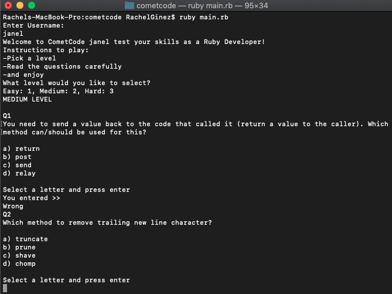
## Brainstorming on the Trello board
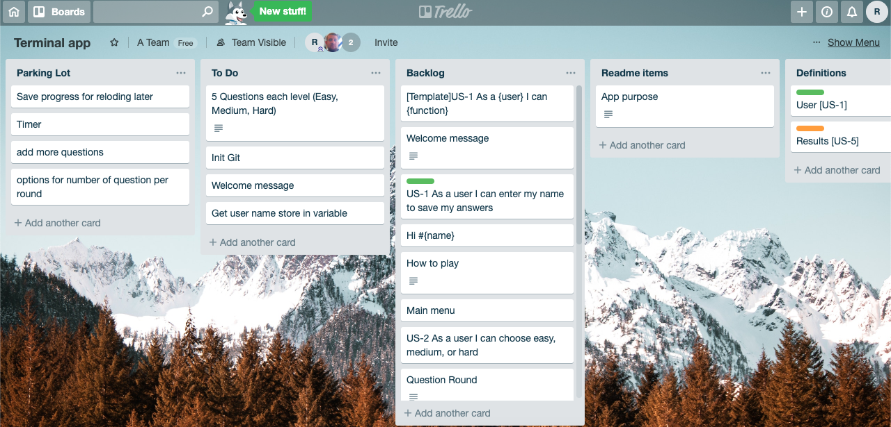
## Ticking things off the list!
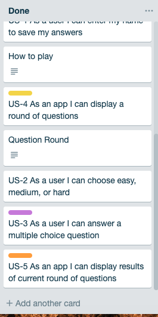 
## Making it pretty (Added colorize gem)
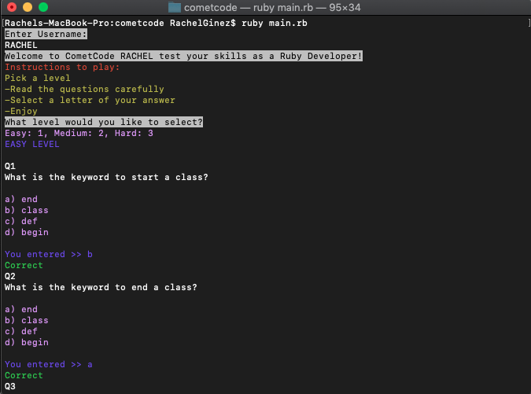
## Basic flow chart
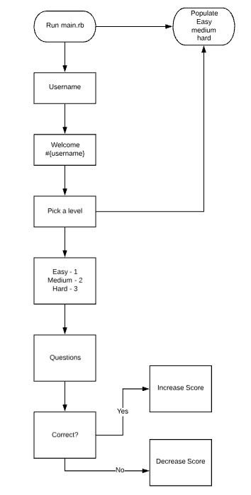

- Future enhancements 
    - saving user progress
        The data structure was initially designed to manipulate the question set this allows to present the user with more detailed stats. It would require more development time to create an array for the user and save to file, then have the user be able to reload
    - more/harder Questions
        A great deal of time could be put into crafting questions, which was unnecessary for the mvp,  another app could be created to input questions into a save file that could then be loaded from the main menu
    - more levels
        see above
    - timer
        to create a slightly more stressful environment sometimes allow for better learning conditions
- Accessibility concerns
    - vision impairment 
        Colors were chosen for looks but it could be adjust for various eye conditions( aka colorblindness)
    - navigation
        Options were limited to avoid getting lost or hitting the wrong key
- Potential legal, moral, ethical, cultural and safety issues
    - None that bears any trouble perhaps thought should be put into the wording of certain questions
- Possible social, political, cultural, racial, gender andinternational issues
    - Language options
- Details of design & planning process including,
    - Evidence of app idea brainstorming sessions
    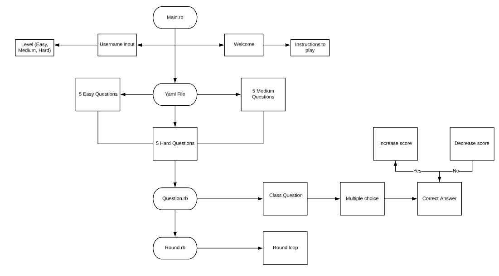
    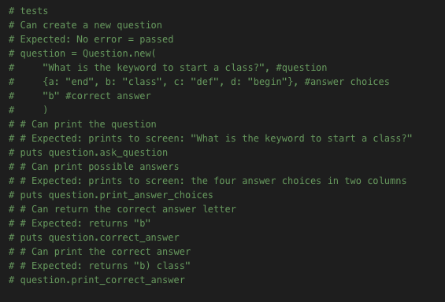
    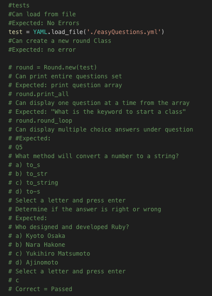
    - User stories
        - US - As a user I can function
        - US - As a user I can enter my username
        - US - As a user I can choose easy, medium or hard
        - US - As a user I can answer multiple question
        - US - As a user I can see if my answer is right or wrong
        - US - As a user I can see the results at the end of the game
    - Project plan & timeline
    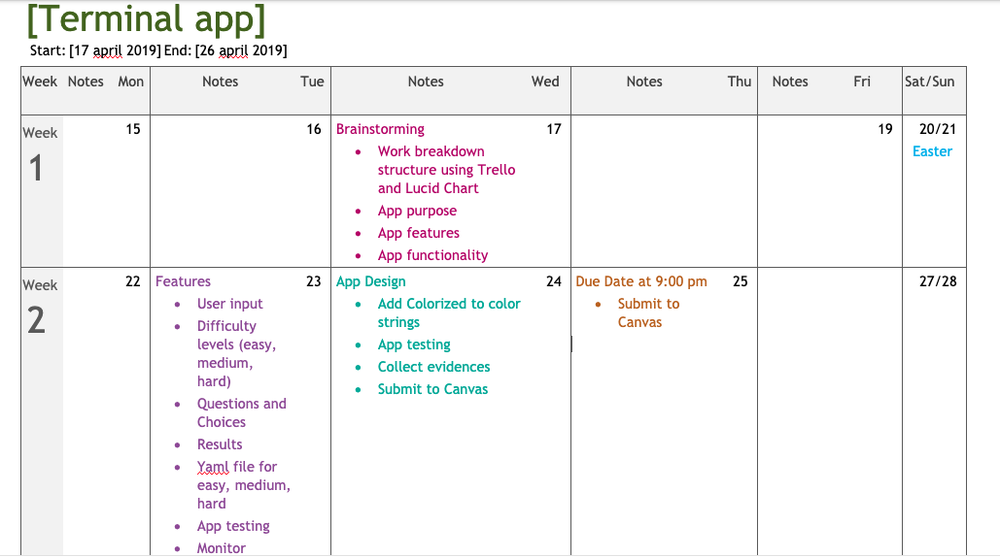
    - Description of overall app design (classes, files, basic flow)
    

    - Design considerations and choices
    
    
    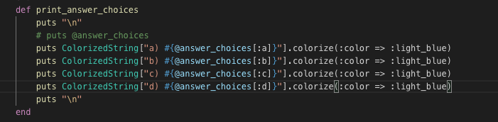
    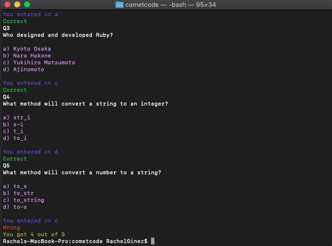
    - Screenshots of Trello board(s)
    
    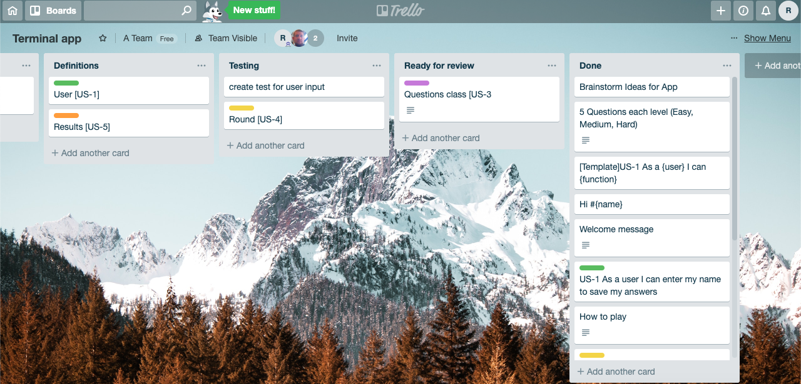
    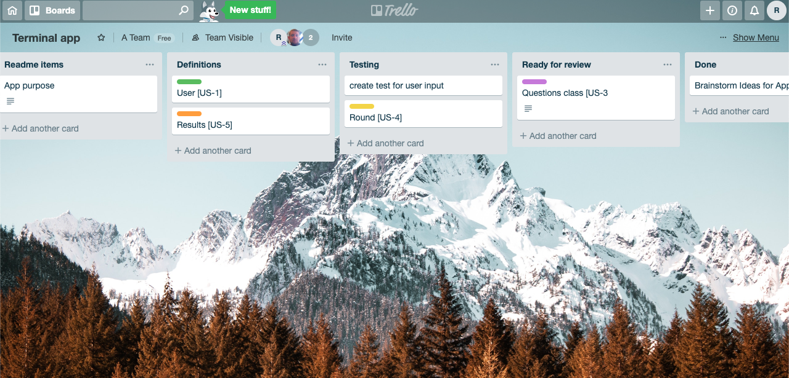
     

